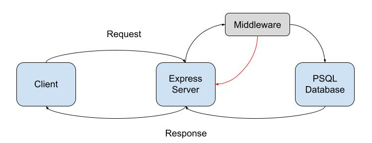

# bearer-auth
Code Fellows 401 JavaScript Lab 7

This is a practice server & database deployment using [Heroku](https://www.heroku.com/).

[Development Server](https://muckt-bearer-auth.herokuapp.com/)

[Production Server](https://muckt-bearer-auth.herokuapp.com/)

## Getting Started

Download and install [PostgreSQL](https://www.postgresql.org/download/)

Sample `.env`

```.env
DATABASE_URL=postgres://localhost:5432/bearer-auth
DEV_DB_USERNAME=******
DEV_DB_PASSWORD=******
```

Setup Steps

```Bash
# Install Dependencies
npm install

# Initialize Database
npm run create:db

# Running the development server and database - default port is 3001
npm run dev

# Testing the server & database with jest
npm test
```

## Web Request Response Cycle Diagram

